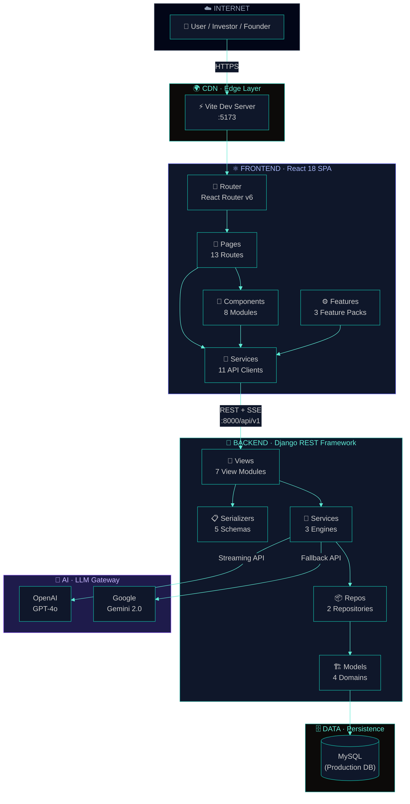
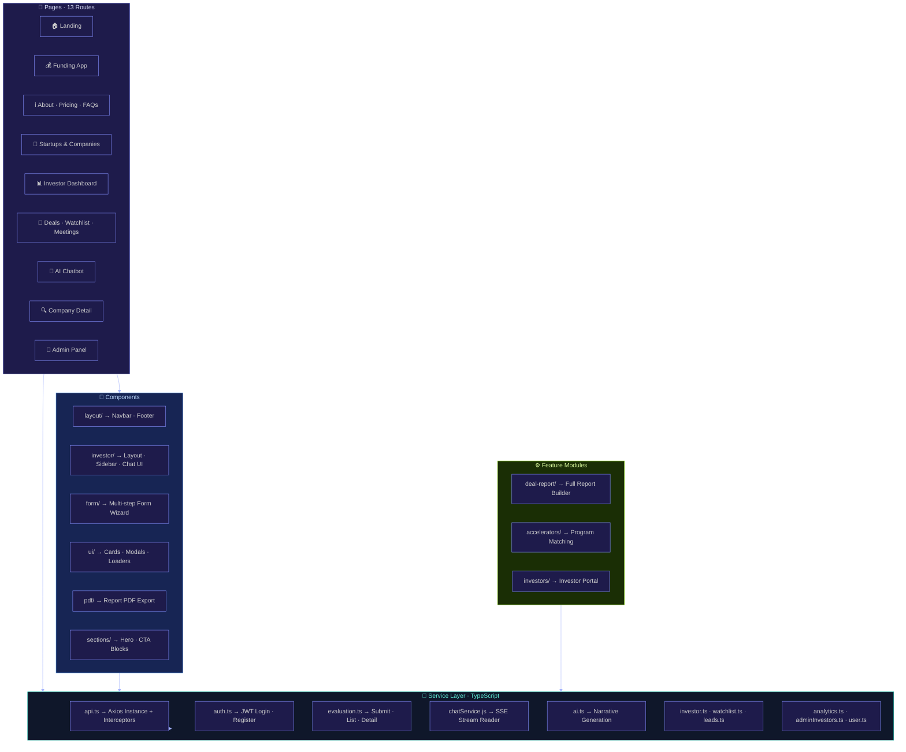
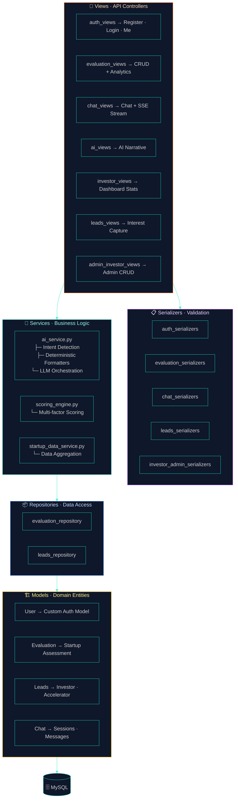
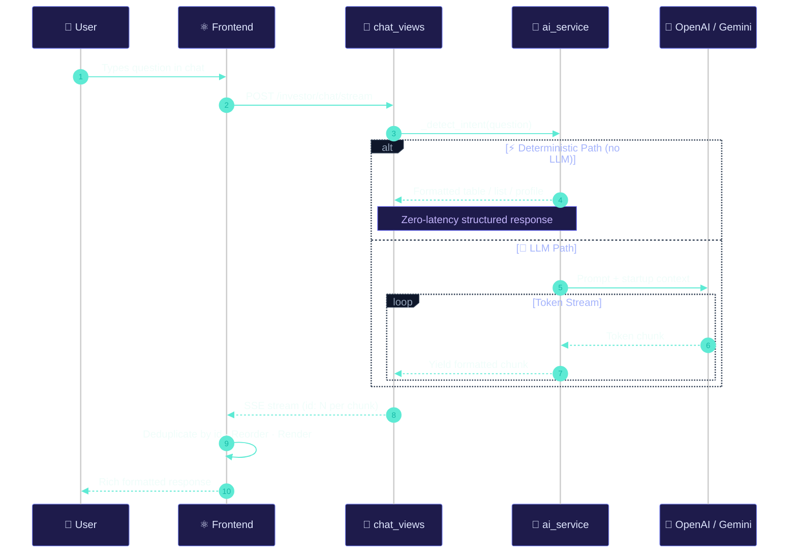

# 🏛️ MATCHPoint AI — System Architecture

<em>Modern AI-assisted startup evaluation platform — Architecture Reference 2026</em>

---

## 🔭 High-Level System Overview

---

## ⚛️ Frontend Deep Dive

---

## 🐍 Backend Deep Dive

---

## 🔄 Core Data Flows

### 💬 AI Chat — SSE Streaming Pipeline

---

## 🗺️ API Endpoints

| Domain | Method | Endpoint | Description |
|:---|:---:|:---|:---|
| **🔐 Auth** | `POST` | `/auth/register/` | New user registration |
| | `POST` | `/auth/login/` | General JWT authentication |
| | `POST` | `/auth/token/refresh/` | Token refresh |
| | `GET` | `/auth/me/` | Current user profile |
| **📊 Evaluations** | `POST` | `/evaluations/create/` | Create draft |
| | `POST` | `/evaluations/submit/` | Submit + score |
| | `GET` | `/evaluations/list/` | List user evaluations |
| | `GET` | `/evaluations/<uuid>/` | Detail view |
| | `GET` | `/evaluations/analytics/summary/` | Analytics dashboard |
| **🤖 AI** | `POST` | `/ai/narrative/` | AI narrative generation |
| | `GET` | `/ai/health` | Service health check |
| **💬 Chat** | `POST` | `/investor/chat/` | Send message |
| | `POST` | `/investor/chat/stream` | SSE streaming chat |
| | `GET` | `/investor/chat/sessions` | List sessions |
| | `GET` | `/investor/chat/sessions/<uuid>` | Session history |
| **📈 Investor** | `POST` | `/auth/login/` | Investor portal login |
| | `GET` | `/investor/dashboard-stats` | KPI metrics |
| | `GET` | `/startups` | Browse startups |
| **📝 Leads** | `POST` | `/leads/investors/` | Investor interest |
| | `POST` | `/leads/accelerators/` | Accelerator interest |
| **⚙️ Admin** | `POST` | `/auth/login/` | Admin portal login |
| | `*` | `/admin/investors/` | Investor CRUD |
| | `POST` | `/admin/investors/from-lead/` | Convert lead → investor |

---

## 🛠️ Tech Stack

| Layer | Technology | Version |
|:---|:---|:---:|
| **Frontend** | React + Vite | 18.x / 5.x |
| **Styling** | Tailwind CSS | 3.x |
| **Language** | JSX + TypeScript | — |
| **Routing** | React Router | v6 |
| **Backend** | Django + DRF | 6.x / 3.16.x |
| **Python** | Python | 3.13.x |
| **Filters** | Django Filter | 25.x |
| **Auth** | SimpleJWT | 5.x |
| **AI Primary** | OpenAI GPT-4o | latest |
| **AI Fallback** | Google Gemini 2.0 | latest |
| **Database** | MySQL | latest |
| **Streaming** | Server-Sent Events | — |

---

MATCHPoint AI · Architecture Reference · March 2026

