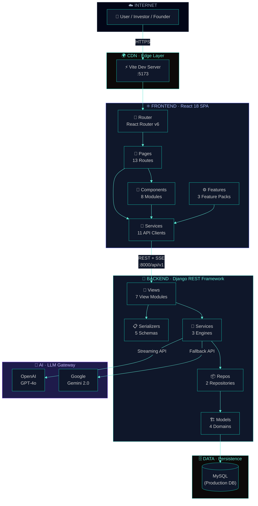

<div align="center">

# MATCHPoint

Modern, AI‑assisted platform for evaluating startups with consistent signals, risk checks, and investor‑grade insights.

  

</div>

---

## ✨ Highlights
- Dynamic response formatting: chat answers render as tables, lists, comparisons, or narratives automatically
- Natural‑language intent: understands “top 10 above score 20”, “compare X vs Y”, “tell me about Z”
- Robust SSE streaming: ordered chunks with deduping for clean, flicker‑free chat
- Investor‑grade guardrails: never fabricates numbers; clearly states when data isn’t available
- Clean UI: About, Pricing, FAQs, and a global footer integrated

---

## 🏛️ System Architecture



> **Note**: For a deep dive into frontend, backend, data flows, and API endpoints, view the full [Architecture Reference](Architecture/architecture_diagram.md).

Key flows:
- Deterministic pre‑answer: backend inspects the question and returns a structured answer when possible (no LLM needed).
- SSE streaming: when using LLMs (if keys configured), messages stream with `id:` headers; client dedupes and preserves order.
- Frontend rendering: pipe‑delimited tables auto‑render to a styled table; bullets/headings auto-format for readability.

---

## 🚀 Quick Start

### Prerequisites
- Node.js 18+
- Python 3.11+

> Dev uses SQLite by default. No extra DB setup required.

### 1) Backend (Django API)

```bash
cd backend
python -m venv .venv
. .venv/Scripts/activate  # Windows PowerShell: .venv\Scripts\Activate.ps1
pip install -r requirements.txt

# Configure environment (optional; defaults are sensible)
copy .env.example .env  # or cp .env.example .env

python manage.py migrate
python manage.py runserver
```

API runs at: http://127.0.0.1:8000/

### 2) Frontend (Vite + React)

```bash
cd frontend
npm install
npm run dev
```

App runs at: http://127.0.0.1:5173/

> If your API runs on another host/port, set `VITE_API_URL` in `frontend/.env.local`:
> `VITE_API_URL=http://127.0.0.1:8000/api/v1`

---

## 🧠 Chat: Dynamic Response Formatting

Implemented in:
- [ai_service.py](backend/core/services/ai_service.py)
- [chat_views.py](backend/core/views/chat_views.py)
- Frontend renderer: `src/components/investor/chat/*`

Detected intents (examples):
- Table: “show the company table”, “table with columns”
- List: “list startups with stage and score”
- Rank: “top 10 companies score more than 20”
- Compare: “compare Unicorn Tech vs MySQLTestCo”, “compare X, Y”
- Company profile/metric: “tell me about Beta”, “what is Alpha’s MRR?”
- Summary: “quick overview of visible startups”

Formatters:
- Rank table: `Rank | Company | Score | Stage | Country | Rating`
- Comparison table: `Metric | <Company A> | <Company B> …`
- Clean lists and summaries with missing data shown as “—”

Streaming:
- Server emits `id:` for every SSE chunk
- Client dedupes and orders chunks; tables and lists render cleanly

Guardrails:
- If a metric is missing, the system explicitly says it’s not in platform records
- Unrelated requests trigger a professional refusal

---

## 🧪 Tests

```bash
cd backend
python manage.py test core -v 2
```

---

## 🧭 UI Pages

- `/about` – Mission, value props, and contact CTA
- `/pricing` – Plans for founders, investors, and accelerators
- `/faqs` – Collapsible Q&A with platform expectations

All pages share the global Navbar and new Footer.

---

## 🔧 Configuration

Backend `.env` (optional):
- `OPENAI_API_KEY` – enable LLM answers (fallbacks if not set)
- `GEMINI_API_KEY` – optional Gemini fallback
- `DJANGO_SETTINGS_MODULE` – choose environment profile

Frontend `.env.local` (optional):
- `VITE_API_URL` – base URL for API (e.g., `http://127.0.0.1:8000/api/v1`)

---

## 🖼️ Screenshots

Add screenshots to `docs/screenshots/` and they will appear here automatically:


Tips:
- Use 1400×800 (or similar) for consistent aspect ratio.
- Dark mode screenshots look best with the current theme.

---

## 🙋 Contributor Quick FAQ

Q: How do I run both apps together?  
A: Start Django (`python manage.py runserver`) on :8000 and Vite (`npm run dev`) on :5173. Set `VITE_API_URL` to your API base.

Q: Where is chat formatting logic?  
A: Backend: `backend/core/services/ai_service.py` (intent + formatters).  
   Frontend: `src/components/investor/chat/` (SSE reader + renderer).

Q: Why do I sometimes see “Information not available…”?  
A: Guardrails avoid fabrication. Add the metric to platform records or relax the display if appropriate.

Q: How do I add a new deterministic format?  
A: Add detection in `_detect_intent`, the formatter function, and a simple renderer pattern in ChatMessage if needed.

Q: Tests?  
A: `python manage.py test core -v 2`. Add unit tests in `backend/core/tests.py`.

---

## 🗺️ Developer Guide

Where to extend:
- Intent detection: `ai_service._detect_intent`
- Structured outputs: `_format_rank_table`, `_format_compare_selected`, `_company_profile`
- Stream behavior: `chat_views.event_stream` (SSE, ids)
- Frontend rendering: `ChatMessage.jsx` (table, list, headings)

Tips:
- When adding new formats, return deterministic text the renderer can recognize (e.g., pipe tables or bullet lists).
- Keep sections concise; the UI styles headings and bullets automatically.

---

## 📄 License
Private – Internal use only.

---

<div align="center">
  <sub>Built with ❤️ for clarity in startup investing.</sub>
</div>
